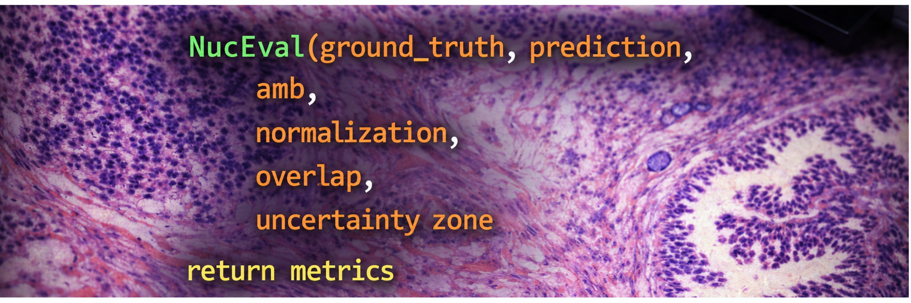
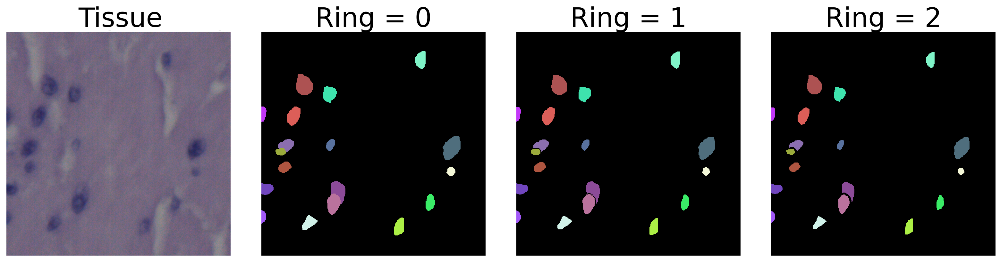

<p align="center">
  
</p>

<h1 align="center">NucEval: Robust Evaluation of Nuclei Instance Segmentation through Handling Vague Regions, Score Normalization, Overlapping Instances, and Border Uncertainty</h1>


<p align="center">
  <a href="#requirements">Requirements</a> •
  <a href="#quick-start">Quick Start</a> •
  <a href="#features">Features</a> •
  <a href="#interface">Interface</a> •
  <a href="#examples">Examples</a> •
  <a href="#citation">Citation</a> •
  <a href="#references">References</a>
</p>

---

## Why NucEval?

Standard nuclei segmentation evaluation has several known issues that can lead to unfair or inaccurate metric scores:

| Problem | Impact | NucEval Solution |
|---------|--------|------------------|
| **Ambiguous regions** | Annotators identify uncertain regions; however, evaluation metrics still penalize or reward predictions within these areas. | Instances that partially overlap with vague zones, as determined by a predefined threshold, are excluded prior to scoring. |
| **Overlapping annotations** | ROI-based GT allows overlapping nuclei, but label maps force one label per pixel — losing boundary information | Accepts ROI files or list of binary masks (one instance per mask)|
| **Score normalization** | Simple averaging treats images with 3 nuclei the same as images with 300 | Optional nuclei-weighted averaging across images of a dataset |
| **Border uncertainty** | Exact nucleus boundaries are inherently uncertain by a few pixels | Boundary ring masks out uncertain pixels from both GT and prediction |

NucEval wraps all of these into **a single function call** with sensible defaults — so the simplest call gives you standard evaluation, and each feature can be enabled independently.

---

## Requirements

```bash
pip install numpy scipy opencv-python
```

Then copy `nuceval.py` into your project. That's it! single file, no build step.

**Dependencies:** NumPy, SciPy, OpenCV (cv2)

---

## Quick Start

```python
from nuceval import NucEval

# Standard evaluation — identical to traditional metrics
result = NucEval(gt_label_map, pred_label_map)
print(result)
# {'dice': 0.92, 'aji': 0.85, 'dq': 0.90, 'sq': 0.88, 'pq': 0.79}
```

That's all you need for basic usage. Every other feature is opt-in.

---

## Features

### 1. Ambiguous region handling

Exclude nuclei that overlap with annotator-flagged uncertain regions:

```python
result = NucEval(gt, pred, amb=amb_mask)

# Custom overlap threshold (default: 0.25)
result = NucEval(gt, pred, amb=amb_mask, overlap_thresh_amb=0.5)
```

An instance is removed (from both prediction and GT) if more than `overlap_thresh_amb` fraction of its area falls in the ambiguous zone.


### 2. Score normalization

Enable nuclei-weighted averaging across images of a dataset:

```python
result = NucEval(gt, pred, normalized=True)
# result now includes 'num_nuclei': 24
```

Use `num_nuclei` to compute weighted means, so images with more nuclei contribute proportionally more to the dataset score.

### 3. Handeling overlapping instances (with flexible GT formats)

NucEval auto-detects the ground truth format:

```python
# Label map (numpy array, 0 = background)
result = NucEval(gt_label_map, pred)

# ROI directory (ImageJ/FIJI .roi files — handles overlapping instances)
result = NucEval("path/to/roiset/", pred)

# List of binary masks (from any source)
result = NucEval([mask1, mask2, mask3], pred)
```
Examples of accepted annotation formats for an image can be found in the [annotation_examples](./annotation_examples) folder.

### 4. Boundary uncertainty ring

Account for annotation uncertainty at nucleus borders:

```python
result = NucEval(gt, pred, ring_width=1) #(0 = disabled)
```

For each GT instance, the mask is eroded and dilated by `ring_width` pixels. The ring between the eroded core and the dilated boundary is masked out from **both** GT and prediction before scoring. This prevents penalizing predictions for disagreeing with GT in the inherently uncertain boundary zone.

<p align="center">
  
</p>


### Others: configurable PQ matching and selective metrics:

Adjust the IoU threshold for instance matching (this threshold is part of PQ impelentaion [1]):

```python
# Configurable IoU matching (default Standard)
result = NucEval(gt, pred, match_iou=0.5) #(default: 0.5)


# Compute only what you need (selective metrics):

# Only Dice and PQ
result = NucEval(gt, pred, metrics=["dice", "pq"])
# {'dice': 0.92, 'pq': 0.79}

# Only instance-level metrics
result = NucEval(gt, pred, metrics=["aji", "dq", "sq", "pq"])
```

---

## Interface

```python
NucEval(ground_truth, prediction,  # both with size of (H,W)
        amb=None,                  # Ambiguous mask (H,W), non-zero = ambiguous
        normalized=False,          # Include num_nuclei in output
        ring_width=0,              # Boundary ring width in pixels (0 = disabled)
        overlap_thresh_amb=0.25,   # Fraction threshold for ambiguous removal
        match_iou=0.5,             # IoU threshold for PQ matching
        metrics=None)              # List of metrics, or None for all
```

**Parameters:**

| Parameter | Default | Description |
|-----------|---------|-------------|
| `ground_truth`       | *required*   | Label map, list of binary masks, or path to ROI directory |
| `prediction`         |  *required*  | Instance label map (H,W), 0 = background |
| `amb`                | `None`       | Ambiguous region mask |
| `normalized`         |  `False`     | If True, include `num_nuclei` in output |
| `ring_width`         |  `0`         | Boundary ring width (0 = no ring) |
| `overlap_thresh_amb` |  `0.25`      | Ambiguous overlap threshold |
| `match_iou`          |  `0.5`       | PQ matching IoU threshold |
| `metrics`            |  `None`      | Subset of `["dice", "aji", "dq", "sq", "pq"]` |

**Returns:** `dict` with requested metric scores.

---

## Examples

### Single image evaluation

```python
from nuceval import NucEval
import tifffile
from mahotas import imread


gt = tifffile.imread("./examples/GT/human_bladder_01.tif") # case 1
####################################################################
gt = "./examples/GT/human_bladder_01_roiset" # case 2
####################################################################
gt_dir = r"./examples/GT/human_bladder_01_png_masks" # case 3
gt = [cv2.imread(os.path.join(gt_dir, f), cv2.IMREAD_GRAYSCALE) // 255
          for f in sorted(os.listdir(gt_dir)) if f.endswith('.png')]
####################################################################
pred = np.load("./examples/Prediction/human_bladder_01.npy") #example with .npy format (could be also .tif)
amb_mask = imread("./examples/amb_masks/human_bladder_01.png")

# All features enabled
result = NucEval(gt, pred,
                 amb=amb_mask,
                 normalized=True,
                 ring_width=2,
                 match_iou=0.5)

print(f"Dice: {result['dice']:.4f}")
print(f"PQ:   {result['pq']:.4f}")
print(f"Nuclei: {result['num_nuclei']}")

# Case 1:  Dice: 0.8833, PQ:   0.6742, Nuclei: 19
# Case 2:  Dice: 0.8883, PQ:   0.6787, Nuclei: 19
# Case 3:  Dice: 0.8883, PQ:   0.6787, Nuclei: 19

```

### Dataset evaluation with CSV output

Run `evaluate_dataset.py`

---
## Metrics
The core implementation is adapted from [1].
| Metric | What it measures | Range |
|--------|-----------------|-------|
| **Dice** | Pixel-level overlap (binary foreground) | 0-1 |
| **AJI**  | Aggregated Jaccard Index  | 0–1 |
| **DQ**   | Detection Quality — F1 score of instance matching | 0–1 |
| **SQ**   | Segmentation Quality — mean IoU of matched pairs | 0–1 |
| **PQ**   | Panoptic Quality = DQ × SQ | 0–1 |

---

## Models
We evaluated NucEval using predictions obtained from three trained models: Hover-Net [2], Hover-Next [3], and CellViT [4].  
The implementations are available in the original publications. The 5-fold cross-validation used in this study for each model is also available in the [hover-net](./hover_net) (`run_hovernetFolds.py`), [hover-next](./hover_next) (`run_hovernextFolds.py`), and [CellViT](./CellViT) (`run_cellvitFolds.py`) folders.


---

## Citation

If you use NucEval in your research, please cite (will be updated upon publication):

```bibtex
@software{nuceval,
  title={NucEval: Robust Evaluation of Nuclei Instance Segmentation through Handling Vague Regions, Score Normalization, Overlapping Instances, and Border Uncertainty},
  author={Amirreza Mahboda, Ramona Woitek, Jeanne Shen},
  year={2026},
  url={https://github.com/masih4/nuc_eval}
}
```

---

## References
[1] https://github.com/vqdang/hover_net  
[2] Graham S, Vu QD, Raza SE, Azam A, Tsang YW, Kwak JT, Rajpoot N. Hover-net: Simultaneous segmentation and classification of nuclei in multi-tissue histology images. Medical image analysis. 2019 Dec 1;58:101563.  
[3] Baumann E, Dislich B, Rumberger JL, Nagtegaal ID, Martinez MR, Zlobec I. Hover-next: A fast nuclei segmentation and classification pipeline for next generation histopathology. InMedical Imaging with Deep Learning 2024 Dec 23.  
[4] Hörst F, Rempe M, Heine L, Seibold C, Keyl J, Baldini G, Ugurel S, Siveke J, Grünwald B, Egger J, Kleesiek J. Cellvit: Vision transformers for precise cell segmentation and classification. Medical image analysis. 2024 May 1;94:103143.  


## License

[MIT License](LICENSE)
